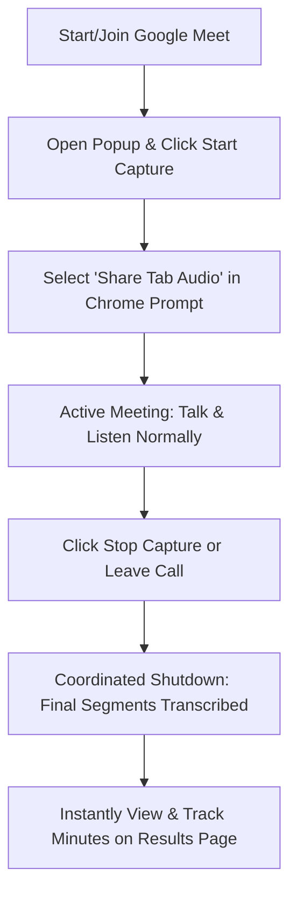

# Meet Minutes Pro — Official User Manual (v1.2.0)

Welcome to **Meet Minutes Pro**, a privacy-first, ultra-fast meeting recorder and progressive speech-to-text summarization engine for Google Meet. 

By capturing your browser tab's digital audio output and mixing it natively with your microphone stream, Meet Minutes Pro generates beautifully structured, Notion-style meeting summaries, decisions, and interactive Kanban task boards in just 4 seconds—**without using databases or storing your private conversations.**

---

## 📋 1. Core Prerequisites
To record and transcribe your meetings successfully, ensure you have:
1. **Google Chrome Browser** (or any Chromium-based browser like Brave or Microsoft Edge).
2. **Working Microphone** (optional but highly recommended to capture your own voice).
3. **Google Meet Session** (active inside a browser tab).

---

## 🚀 2. 60-Second Installation Guide

Since Meet Minutes Pro runs with zero third-party databases, installing the extension manually is fast and requires no signup:

1. **Download the Extension Zip**: 
   Download the compiled files directly from your website at: **`https://minutes-maker-five.vercel.app/meet-minutes-pro.zip`**
2. **Extract the Files**: 
   Unzip the downloaded `meet-minutes-pro.zip` archive into a local folder on your computer (e.g. inside `Documents` or your `Desktop`).
3. **Open Extensions Manager**: 
   Open Google Chrome, navigate to **`chrome://extensions`** in your URL bar, and toggle the **"Developer mode"** switch **ON** in the top-right corner.
4. **Load Unpacked**: 
   Click the **"Load unpacked"** button in the top-left corner, select the extracted **`/extension`** folder from Step 2, and click **Select Folder**.
5. **Pin the Extension**: 
   Click the puzzle piece icon 🧩 in your Chrome toolbar, find **Meet Minutes Pro**, and click the Pin icon 📌 for instant access.

---

## 🎙️ 3. How to Use: Step-by-Step Flow

### Step 1: Start or Join your Google Meet Call
Navigate to [meet.google.com](https://meet.google.com/) and enter your meeting room.

### Step 2: Initiate Recording
1. Click the **Meet Minutes Pro** icon ⚡ in your Chrome toolbar to open the control panel.
2. Click the purple **Start Capture** button.

### Step 3: Grant Chrome Permissions (Critical!)
When you click start, Google Chrome will display a native share dialog to capture tab audio:
1. Under the **Chrome Tab** tab, click on the **current Google Meet tab** to highlight it.
2. **IMPORTANT**: Look at the bottom-left of the popup window and ensure the **"Share tab audio"** checkbox is **checked** (toggled on). If this checkbox is unchecked, the extension will not be able to hear other participants!
3. Click **Share**.

### Step 4: Microphone Permission (First-time only)
The browser will prompt you to allow microphone access. Click **Allow**. Meet Minutes Pro will now mix your voice (microphone) with the voices of other participants (tab capture) into a combined, high-fidelity audio mix.
> **Note**: If you block microphone access, the extension will fall back to capturing other participants' voices only.

### Step 5: Speak Normally
During the meeting:
* You can hear all other participants clearly thanks to our built-in **Web Audio Speaker Loopback**.
* The extension slices your audio every 20 seconds, transcribes it securely in the background using Groq Whisper, and updates the **"Captured Lines"** counter progressively.
* The popup visualizer waves actively to indicate healthy audio levels.

### Step 6: Complete the Session
When you are ready to compile your minutes:
1. **Manual Stop**: Open the extension panel and click **Stop Capture**.
2. **Automatic Stop**: Simply close the Google Meet tab or hang up! The passive supervisor script will automatically detect the exit and trigger the stop flow.
3. *Coordinated Shutdown*: The extension will remain active for 2–4 seconds to finish transcribing the final chunk of speech, ensuring no final remarks are lost.

### Step 7: Interact with your Minutes
The system will instantly compile your transcript and redirect you to the **gorgeous interactive results portal**:
* **Document View**: Read your minutes formatted as Notion-style headers, bullet points, decisions, and action items with time markers.
* **Interactive Kanban Board**: Switch to board view to check/uncheck tasks, view owners/avatars, review verbatim evidence quotes, and copy individual tasks.
* **Export Options**: Copy the full markdown to your clipboard, download it as a static `.md` file, or click **Print PDF** to generate clean, paper/digital copies.

---

## 🔒 4. Privacy & Security Design

Meet Minutes Pro is designed from the ground up for absolute security and compliance:
* **Zero Databases**: We do not store, track, or log any audio, transcriptions, or meeting details.
* **Instant In-Memory Summaries**: All summaries are processed on-the-fly and returned in the HTTP response.
* **Client-Side Storage**: Summaries are sent directly to your browser URL as an encrypted base64 hash (`/result#encoded-minutes`). If you close the tab, the meeting data is gone forever—your data remains entirely yours.

---

## 🛠️ 5. Troubleshooting & FAQ

#### Q1: The transcription didn't capture what other participants said.
* **Solution**: You likely forgot to toggle the audio sharing checkbox during Step 3. Stop capture, start a new capture session, and make sure that the **"Share tab audio"** checkbox is explicitly checked in Chrome’s native prompt window.

#### Q2: The transcription didn't capture what I said.
* **Solution**: Ensure your computer's default microphone is turned on and not muted in system settings. Make sure you clicked "Allow" when the extension requested microphone permissions.

#### Q3: The summarized result is empty or says "No Meeting Minutes Detected".
* **Solution**: Ensure you actually spoke or played audio during the session. If the compiled audio blob is too small (e.g. less than 1KB, which is equivalent to silence), the transcriber disregards it to prevent blank requests.

#### Q4: Will it work if I mute my microphone inside Google Meet?
* **Solution**: Yes! Mututing yourself inside Google Meet only silences you for other participants. Your local microphone stream still inputs to your computer, meaning Meet Minutes Pro will continue to record and transcribe your voice perfectly!
