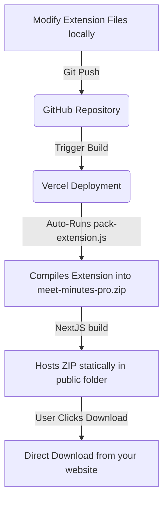

# Meet Minutes Pro — All-Round Production Deployment Playbook

This document details the automated packaging workflow, the distribution model for your users, and the step-by-step format for releasing updates going forward.

---

## 🚀 1. How the Extension is Distributed and Downloaded

Because we built the **Automated Next.js Packaging Pipeline**, distributing updates is fully hands-off and integrated into your Git/Vercel workflow:



### Option A: Static ZIP Distribution (No Setup Cost)
1. When you push your code to your Vercel project, Vercel automatically runs the Node script `pack-extension.js` during the build lifecycle.
2. This creates a fresh, compiled package at **`https://minutes-maker-five.vercel.app/meet-minutes-pro.zip`**.
3. Users visiting your website can download this ZIP directly in one click.
4. They extract it locally and load the folder in Chrome via **Developer Mode** ("Load Unpacked"), following the 3-step guide on your landing page.

### Option B: Chrome Web Store Submission (Premium 1-Click Install)
If you want to allow users to install the extension directly from Google’s official web store in one click:
1. Register a developer account at the [Chrome Web Store Developer Console](https://chrome.google.com/webstore/devconsole) (requires a one-time $5 USD verification fee).
2. Download the packaged **`meet-minutes-pro.zip`** (from your local build under `web/public/meet-minutes-pro.zip`).
3. Click "New Item" on the Developer Console and upload the ZIP.
4. Google will review and publish it (usually takes 1–3 business days).
5. Once live, replace the `/meet-minutes-pro.zip` link on your Next.js landing page with your official Chrome Web Store URL!

---

## 📅 2. Format & Version Update Timeline Going Forward

When you want to add new features, adjust parameters, or fix issues in the future, follow this structured format to ensure zero disruption and 100% production stability:

### Step 1: Edit & Local Testing
1. Make your changes inside the `/extension` files (e.g. adding new UI features in `popup.html` or tweaking capturers in `content.js`).
2. **Sync locally**: Open `chrome://extensions` in Google Chrome and click the **Reload icon (↻)** on the *Meet Minutes Pro* card to sync your local directory immediately.
3. Open Google Meet and verify your changes locally.

### Step 2: Bump the Version Number
Before pushing updates, update the version number to keep track of changes:
1. Open `/extension/manifest.json` and change `"version": "1.1.0"` to your new version (e.g., `"1.2.0"`).
2. Open `/web/app/page.tsx` and change the header version badge (`v1.1`) to match.

### Step 3: Trigger the Automated Package Build
Run a build in your terminal inside `/web`:
```bash
npm run build
```
* **What happens**: The system automatically executes `pack-extension.js`, which takes all your fresh `/extension` files, compresses them, and replaces `/web/public/meet-minutes-pro.zip` with the new version.

### Step 4: Git Push & Auto-Deploy
1. Commit all your changes (both in `/extension` and `/web`) to your Git repository:
   ```bash
   git add .
   git commit -m "feat: updated extension to v1.2.0"
   git push origin main
   ```
2. **Vercel Magic**: Vercel detects your push, runs the build command, executes our packaging script in the Vercel cloud container, compiles your Next.js site, and **instantly serves the updated `.zip` file** on your website!
3. Any new user downloading the ZIP from your site will instantly receive the latest version.

---

## 🛡️ 3. Environment Variable Security & Sync

Your API keys (Groq & Gemini) live **100% server-side on Vercel**. They are never compiled into the extension ZIP, which protects your API keys from being extracted or stolen by users:

* **Local Environment (`/web/.env.local`)**:
  Used only for your local development and API testing.
* **Production Environment (Vercel Settings)**:
  Used by the live API. Make sure you add these keys to your Vercel project variables:
  - `GROQ_API_KEY_1` to `5` = (Your Groq API Keys)
  - `LLM_FALLBACK_KEY` = (Your Gemini API Key)
